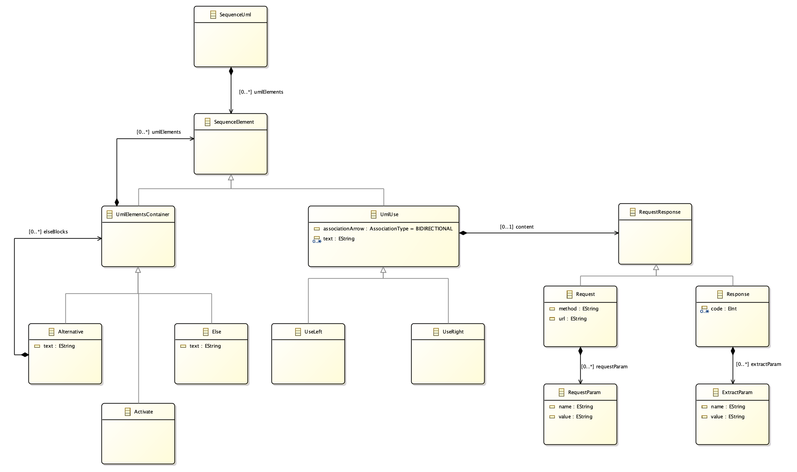
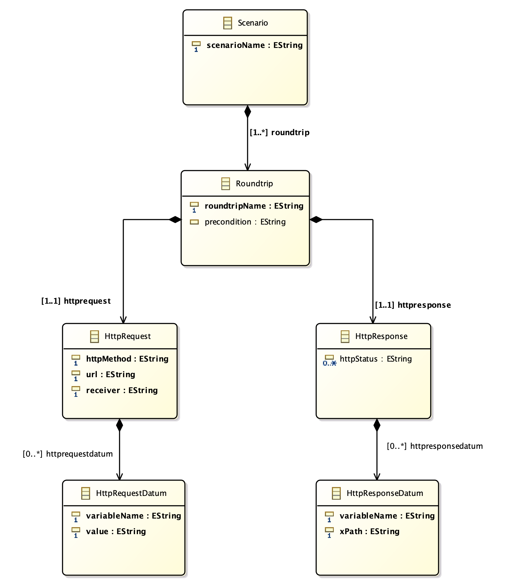
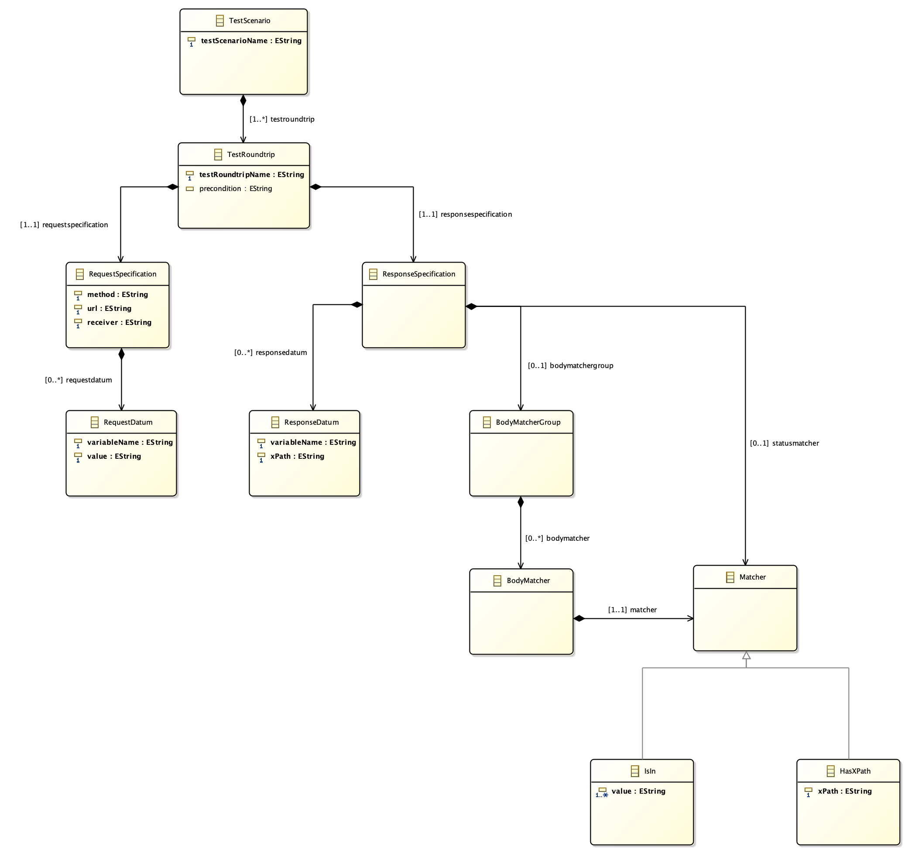

# Plantestic
[](https://travis-ci.com/FionaGuerin/plantestic.svg?token=qCz9ynu1x7xYBT4zA1MS&branch=master)  

## Description
The test case generator Plantestic produces test cases from a sequence diagram. 
A sequence diagram models a sequence of interactions between objects. 
A test case then checks for such an interaction whether it is implemented as the sequence diagram defines it. 
In an example sequence diagram called `Hello`, let there be two actors Alice and Bob. 
Alice sends Bob the request `GET /hello ` and Bob answers with `Hello World`. 
The corresponding test case now sends an HTTP request `GET /hello` to the backend. 
The test case then expects a response with status `200 OK` and date `Hello World`.

## Motivation
The implementation of user requirements often deviates from the specification of the same user requirements. 
Individual work, teamwork, and collaboration between teams can produce such a divergence. 
For example, requirements may be misinterpreted or overlooked. 
Teamwork, especially with multiple teams, causes interface errors. 
For example, subsystems of the same product may use conflicting technologies or conflicting data formats.

Our test case generator detects deviations at an early stage: 
The test case generator derives test cases directly from the specification. 
If the implementation fulfills these test cases, then the implementation fulfills the specification. 
If the implementation does not fulfill these test cases, the implementation deviates from the specification. 
With our test case generator, developers can quickly uncover inconsistencies, fix them, and save costs.## Demo

## Features

## Technologies
### Eclipse Modelling Framework (EMF)
The Eclipse Modeling Framework serves modeling and code generation. 
From a model specification in XMI, it produces an equivalent set of classes in Kotlin.  
Website: [https://www.eclipse.org/modeling/emf/](https://www.eclipse.org/modeling/emf/)

### XML Metadata Interchange (XMI)
XML Metadata Interchange is an exchange format among software development tools. 
For example, XML Metadata Interchange represents UML diagrams textually within the Eclipse Modeling Framework.  
Website: [https://www.omg.org/spec/XMI/About-XMI/](https://www.omg.org/spec/XMI/About-XMI/)

### PlantUML
The open source tool PlantUML produces a UML diagram from simple text language. 
Such a PlantUML diagram can be a sequence diagram, use case diagram, class diagram, activity diagram, component diagram, 
state diagram, object diagram, deployment diagram, or timing diagram.  
Website: [http://plantuml.com](http://plantuml.com)

### REST Assured
The Rest-assured library simplifies the verification and validation of REST APIs. 
As such, the test techniques of Rest-assured follow the test techniques of dynamic languages such as Ruby and Groovy. 
The library offers all standardized HTTP operations.  
Website: [http://rest-assured.io](http://rest-assured.io)

### Xtext
The Eclipse framework Xtext produces a domain-specific language from a grammar. 
On the one hand, Xtext generates a class diagram for the abstract syntax of the domain-specific language. 
On the other hand, Xtext provides a parser, a linker, a compiler, and a typechecker.  
Website: [https://www.eclipse.org/Xtext/](https://www.eclipse.org/Xtext/) 

### Query View Transformation (QVT)
The programming language set Query View Transformation describes model-to-model transformations. 
Query View Transformations implement the MOF (Meta Object Facility) query-view-transformation standard of the Object Management Group. 
Query View Transformation contains the languages Query View Transformation Operational, Query View Transformation Relations, and Query View Transformation Core. 
The imperative language Query-View-Transformation-Operational serves unidirectional model transformations.  
Website: [https://wiki.eclipse.org/QVTo](https://wiki.eclipse.org/QVTo)

### Acceleo
The model-to-text generator Acceleo produces source code from an EMF model. 
Acceleo is easy to use and it can be customized by adding text to the generated code. 
Acceleo implements the MOF (Meta Object Facility) model-to-text standard of the Object Management Group. 
Website: [https://www.eclipse.org/acceleo/](https://www.eclipse.org/acceleo/)

### WireMock
The WireMock tool simulates an HTTP API.
WireMock mocks an HTTP server whose services are used by a client. 
The HTTP server may therefore be missing or incomplete.
Website: [http://wiremock.org](http://wiremock.org)

## Abstract syntaxes
### PlantUML



### Request/response pairs



### REST Assured



## Installation
1. Install Java SE Development Kit 8 or higher. 
You can find Java SE Development Kit 8 under the website [https://www.oracle.com/technetwork/java/javase/downloads/jdk8-downloads-2133151.html](https://www.oracle.com/technetwork/java/javase/downloads/jdk8-downloads-2133151.html).
2. Clone the Plantestic repository.

## How to use
### Input requirements
The input is a PlantUML sequence diagram. 
This sequence diagram contains several participants and interactions between the participants. 
One participiant is the client who calls the test cases. The other participants are services of the implementation. 
In the example diagram, the client is `CCC` and the services are `CRS` and `Voicemanager`.

An interaction contains a request from the client and a response from a service. 
A request contains an HTTP method, a URL, and possibly parameters. 
A response contains an HTTP status code and, if applicable, data. A hyphen separates the HTTP status codes and the data. 

The HTTP method is `GET`, `POST`, or `PUT`. 

The URL path is a String. In it, slashes separate the path components. 
A parameter name in curly braces, preceded by a dollar symbol, thereby specifies parameterized path components. 
Example: ```/path/${param}```

We specify the request parameters in a tuple: 
An opening bracket is followed by the first request parameter. 
This request parameter is followed - comma-separated - by the second request parameter, and so on. 
The last request parameter is followed by a closing bracket.
We specify the request parameter as a `Name: Value` pair: 
The name of the request parameter is followed by a space, a colon, a space, and the value of the request parameter as a string. 
We define the value of the request parameter in curly brackets, preceded by a dollar symbol. 
Example: ```(name1 : "${value1}", name2 : "${value2}")```

We specify the response data in a tuple: 
An opening bracket is followed by the first response datum. 
This response datum is followed - comma-separated - by the second response datum, and so on. 
The last response datum is followed by a closing bracket.
We specify the response datum as a `Name: XPath` pair: 
The name of the response datum is followed by a space, a colon, a space, and the xpath of the response datum as a string. 
In the xpath, slashes separate the path components. . 
Example: ```(name1 : "/value/value1", name2 : "/value2")```


### Execution
1. Create a PlantUML sequence diagram. Note the input requirements above. 
2. Save the sequence diagram. 
3. Call the command `./gradlew run --args="<path/to/sequence/diagram/diagram_name.puml>"`.

## Repository conventions
### Repository language
English

### Programming Language
Kotlin

### Review process
A pull request addresses a single issue. 

A pull request must be approved by two reviewers.

A pull request is squashed before the merge.

### Naming Conventions: Issues, branches, pull requests, squashed merge commits
Issues describe project work such as tasks, bugs, and feature requests. 
Example: ```Implement task XYZ```

The branch name follows the issue name. 
The automatically generated issue ID is succeeded by the issue name in lowercase letters, with hyphens separating multiple words.
Example: ```#1-implement-task-xyz```

The pull request name is the issue name plus the issue id.
Example: ```Implement task XYZ (Issue #1)```

The squashed merge commit name is the issue name plus the issue id plus the pull request id. 
Example: ```Implement task XYZ (Closes #1) (PR #2)```

If a pull request addresses several issues, the pull request name is a summary of the issues plus the issue ids.
The squashed merge commit name is a summary of the issues plus the issue ids plus the pull request id.
Example pull request: ```Initial Setup (Issue #1, Issue #2, Issue #3)```
Example squashed merge commit: ```Initial Setup (Closes #1, Closes #2, Closes #3) (PR #2)```

## Credits
### Contributors 
- [Stefan Grafberger](https://github.com/stefan-grafberger) *
- [Fiona Guerin](https://github.com/FionaGuerin) *
- [Michelle Martin](https://github.com/MichelleMar) *
- [Daniela Neupert](https://github.com/danielaneupert) *
- [Andreas Zimmerer](https://github.com/Jibbow) *

\* contributed equally

### Repositories
#### plantuml-eclipse-xtext
The repository [plantuml-eclipse-xtext](https://github.com/Cooperate-Project/plantuml-eclipse-xtext) defines the grammar of PlantUML. 
We pass this grammar to Xtext.
   
#### qvto-cli
The repository [qvto-cli](https://github.com/mrcalvin/qvto-cli)demonstrates how QVT operations can be performed without Eclipse.
   
### Literature
#### Standalone Parsing with Xtext
From the article [Standalone Parsing with Xtext](http://www.davehofmann.de/different-ways-of-parsing-with-xtext/) we learned how to use Xtext without Eclipse.
    
#### QVTOML/Examples/InvokeInJava
From the Wiki article [QVTOML/Examples/InvokeInJava](https://wiki.eclipse.org/QVTOML/Examples/InvokeInJava) we learned how to call QVT from our pipeline.

#### Grammar-based Program Generation Based on Model Finding
From the paper [Grammar-based Program Generation Based on Model Finding](http://www.informatik.uni-bremen.de/agra/doc/konf/13_idt_program_generation.pdf) we learned about the Eclipse Modeling Framework.
   
## License
Copyright [2019] [Stefan Grafberger, Fiona Guerin, Michelle Martin, Daniela Neupert, Andreas Zimmerer]

Licensed under the Apache License, Version 2.0 (the "License");
you may not use this file except in compliance with the License.
You may obtain a copy of the License at

  http://www.apache.org/licenses/LICENSE-2.0

Unless required by applicable law or agreed to in writing, software
distributed under the License is distributed on an "AS IS" BASIS,
WITHOUT WARRANTIES OR CONDITIONS OF ANY KIND, either express or implied.
See the License for the specific language governing permissions and
limitations under the License.
